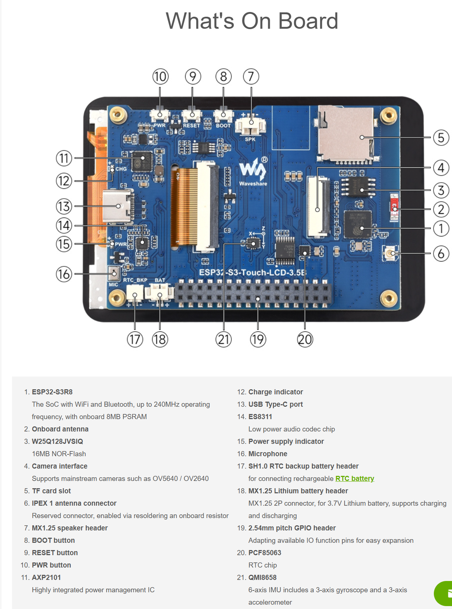
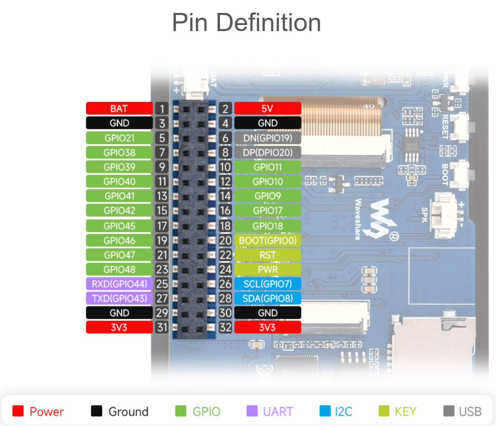
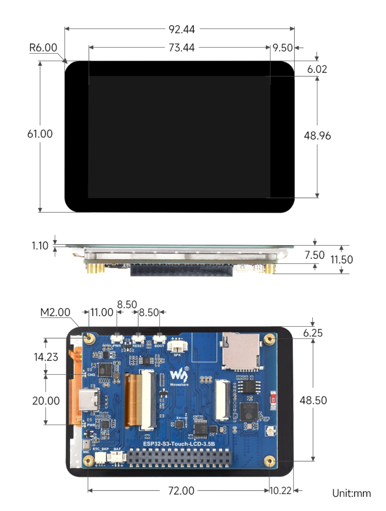
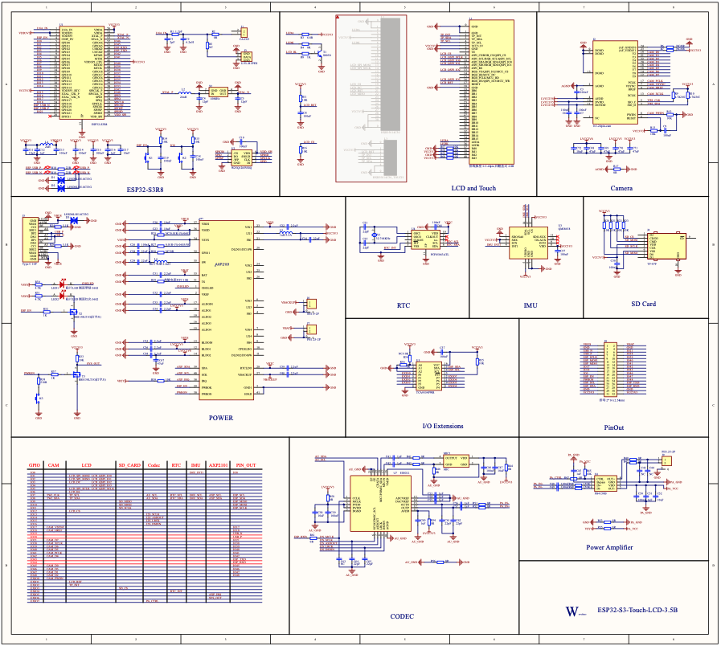

# Waveshare ESP32-S3-Touch-LCD-3.5B
## General Info

* **ESP32-S3R8** Xtensa 32-bit LX7 dual-core processor
   * 512KB of SRAM
   * 384KB ROM
   * 8MB PSRAM, onboard
   * 16MB Flash memory, external
   * 240 MHz clock freq
* 3.5inch display
   * **AXS15231B** LCD & touch controller
   * IPS (In-Plane Switching) capacitive touch display
   * 320 × 480 resolution
   * 262K color 
   * QSPI display interface
   * I2C capacitive touch interface
* 2.4 GHz Radio
   * WiFi b/g/n at 40MHz Bandwidth
   * Bluetooth 5 (BLE)
   * onboard antenna
* **QMI8658** 6-axis IMU
* **PCF85063** RTC chip, 
   * powered by main Lithium battery  
* **AXP2101** chip with battery backup connector
   * 3.7V MX1.25 Lithium battery recharge/discharge header
* I2C, UART, USB, and multiple GPIO pins, for connecting peripherals and debugging 
* Onboard TF card slot  
   * extended storage and fast data transfer 
   * recording and media playback
* Onboard camera interface
   * OV2640 and OV5640 and others
* Arduino and ESP-IDF support

## Board Documentation
This project is built for the [Waveshare ESP32-S3-Touch-LCD-3.5B](https://www.waveshare.com/product/arduino/esp32-s3-touch-lcd-3.5b.htm)

See the full [Documentation](https://www.waveshare.com/wiki/ESP32-S3-Touch-LCD-3.5B)

## Board Overview

## Pinout
Main USB Connector is at the TOP of the image, ie board is held vertically with USB connector facing up)

## Dimensions

## Schematics

## Demos

The following [Demos](https://www.waveshare.com/wiki/ESP32-S3-Touch-LCD-3.5B#Demo_2) contain sample code for the folowing hardware

* IMU (QMI 8563)
* RTC (PCF 85603)
* Power Management (AXP 2101)

as well as LVGL demos.

[Download demos zip](https://files.waveshare.com/wiki/ESP32-S3-Touch-LCD-3.5B/ESP32-S3-Touch-LCD-3.5B-Demo.zip)

